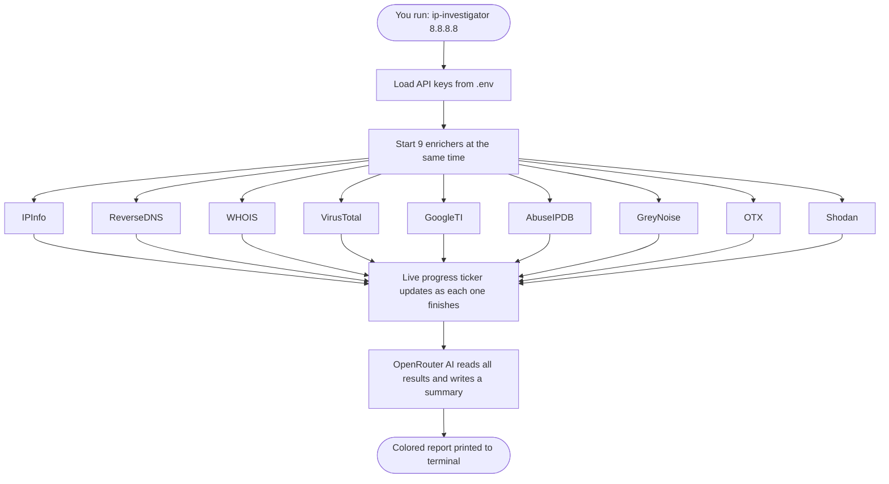

# ip-investigator

A CLI tool that queries 9 threat intelligence APIs at the same time and prints a colored terminal report with an AI summary.


## What it does

You give it an IP address (or a file of IPs). It checks 9 security databases simultaneously, shows a live progress ticker while it works, then prints everything in a colored report — plus an AI paragraph summarizing what it all means.

```
# Single IP
$ ./run.ps1 8.8.8.8

# Multiple IPs from a file
$ ./run.ps1 --file ips.txt
```

## How it works



## The 9 Sources

| Source | What it tells you |
|---|---|
| **IPInfo** | Country, city, ISP, organisation |
| **ReverseDNS** | Hostname linked to the IP |
| **WHOIS** | Who registered the IP block |
| **VirusTotal** | How many security vendors flag it as malicious |
| **Google Threat Intelligence** | Google's own threat verdict and severity |
| **AbuseIPDB** | Community-reported abuse score (0–100) |
| **GreyNoise** | Is this IP mass-scanning the internet? |
| **OTX** (AlienVault) | Known malware and attack campaigns |
| **Shodan** | Open ports and services exposed on this IP |

## Key Terms

- **Enricher** — one module that talks to one data source. All 9 run at the same time (concurrently), so total wait time equals the slowest one — not all of them added together.
- **Threat Intelligence** — collected data about IPs known to be malicious, involved in attacks, or running scanning operations.
- **OpenRouter** — a service that gives you access to AI models (Gemma, LLaMA, etc.) with one API key. Used here to summarize findings in plain English.
- **Context timeout** — a hard 30-second limit on enrichers. If an API hangs, it gets cut off instead of freezing the tool.

## Status Icons

| Icon | Meaning |
|---|---|
| `✓` | Got data successfully |
| `~` | Rate limited (try again later) |
| `-` | No data found for this IP |
| `✗` | Error — missing key, timeout, or API down |

## Setup

**1. Clone the repo**
```bash
git clone https://github.com/aivxx02/ip-investigator.git
cd ip-investigator
```

**2. Create a `.env` file** next to the binary (copy `.env.example` as a starting point):
```env
IPINFO_KEY=your_key_here
VIRUSTOTAL_KEY=your_key_here
GOOGLE_TI_KEY=your_key_here
ABUSEIPDB_KEY=your_key_here
GREYNOISE_KEY=your_key_here
OTX_KEY=your_key_here
SHODAN_KEY=your_key_here
OPENROUTER_KEY=your_key_here
OPENROUTER_MODEL=google/gemma-2-9b-it:free
```

All keys are optional — enrichers with missing keys show `✗` in the report and are skipped.

**3. Build & Run (Windows — one command)**
```powershell
./run.ps1 8.8.8.8
./run.ps1 --file ips.txt
```

**Or build manually then run:**
```bash
go build -o ip-investigator.exe .
./ip-investigator.exe 1.1.1.1
./ip-investigator.exe --file ips.txt
```

**File format for `--file`** (`.txt` or `.md`, one IP per line):
```
8.8.8.8
1.1.1.1
# this is a comment, ignored
9.9.9.9
```

## API Keys

| Service | Free Tier | Link |
|---|---|---|
| IPInfo | 50k req/month | https://ipinfo.io |
| VirusTotal | 500 req/day | https://virustotal.com |
| Google TI | Limited free | https://cloud.google.com/threat-intelligence |
| AbuseIPDB | 1k req/day | https://abuseipdb.com |
| GreyNoise | Community free | https://greynoise.io |
| AlienVault OTX | Free | https://otx.alienvault.com |
| Shodan | Free (limited) | https://shodan.io |
| OpenRouter | Free models available | https://openrouter.ai |
